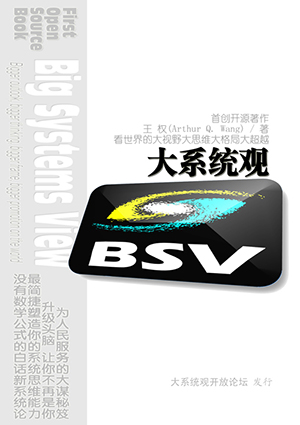
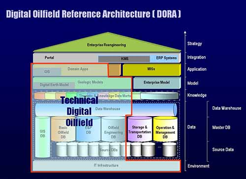

# About me

## Arthur Q. W. (ArthurTreeNewBee)
### ☑️ As the Founder of Thought of Big Systems View
<table border="10">
  <tr>
    <td>
       
        Proposed a pioneering thought, the idea of Big Systems View (BSV), based on traditional systems theory and systems engineering thinking, and combined with own long-term and rich experience in IT systems construction.  
        BSV mainly includes System Structure Dynamics, Holographic Organic System Theory, BSV Philosophy and relevant methodologies, which are applied in the domain of Digital/Intelligent Oilfields and AI development applications.  
    </td>
    <td></td>
  </tr>
</table>
 

### ☑️ As the Author of _Big Systems View_
<table border="10">
  <tr>
    <td>
       In 2016, completed the open source book: 
      &nbsp;&nbsp;&nbsp;&nbsp;Big Systems View: Bigger outlook, bigger thinking, bigger frame, bigger promotion on the world  
      The book rejects the traditional publishing mode, and adopts the form of directly publishing the electronic version on the Internet and inviting everyone to co_compile it, setting a precedent for free and open source electronic books.   
      The book immediately caused a significant response in the relevant fields after its release.
    </td>
    <td></td>
  </tr>
  <tr>
    <td colspan="2">
      Based on the version 1.0 of the original book, various materials (PPT courseware, videos, blogs, articles, etc.) with more complete ideas and richer contents have been formed through continuous iteration. All materials and the original book can be retrieved and downloaded on the Internet, or go to the official website of the [Big Systems View]: http://www.holomind.com.cn .
        
    </td>
  </tr>
</table>
 

### ☑️ As the Proposer of Concept of Digital Oilfield
<table border="10">
    <td>
    In 1999, proposed the concept of Digital Oilfield at first globally, and published numerous academic papers such as "Research and Application of Digital Oilfield Construction Mode in Daqing Oilfield"  over the past years, leading the trend of Digital/Intelligent Oilfield research and construction in China.
Simultaneously, exert all my strength to push the practices of Digital Oilfields construction forward. Integrating knowledge with action, forming a profound theoretical foundation, and accumulating rich practical experience, proposed powerful methodologies for digital construction in large-scale enterprises  based on the philosophy of Big Systems View.
    </td>
    <td></td>
  </tr>
  <tr>
    <td colspan="2">
      在原书1.0版本基础上，通过不断迭代，形成了思想更加完备、内容更加丰富的各种资料（PPT课件、视频、公众号、文章等）。所有资料以及原书均可在互联网上检索并下载，或者，到【大系统观】官网：http://www.holomind.com.cn 下载。
    </td>
  </tr>
</table>
 

In 1999, proposed the concept of Digital Oilfield at first globally, and published numerous academic papers such as "Research and Application of Digital Oilfield Construction Mode in Daqing Oilfield"  over the past years, leading the trend of Digital/Intelligent Oilfield research and construction in China.
Simultaneously, exert all my strength to push the practices of Digital Oilfields construction forward. Integrating knowledge with action, forming a profound theoretical foundation, and accumulating rich practical experience, proposed powerful methodologies for digital construction in large-scale enterprises  based on the philosophy of Big Systems View.

 

### ☑️ As an Old Programmer Keeping Coding

  
# 自我介绍

## 阿色树新风
### ☑️ 大系统观创立者
<table border="10">
  <tr>
    <td>
       
    基于传统的系统论和系统工程思想，结合自身长期、丰富的信息化、数智化建设经验，开创性地提出了全新的大系统观思想。  
    大系统观思想主要包括系统结构动力学、全息有机系统论、大系统哲学和方法论，在其应用于数字/智能油田、大型企业与组织数智化建设和AI开发领域的过程中，显示出了重要指导作用。  
    </td>
    <td></td>
  </tr>
</table>
 

### ☑️ 《大系统观》作者
<table border="10">
    <td>
        2016年完成了开源著作： 
      &nbsp;&nbsp;&nbsp;&nbsp;《大系统观：看世界的大视野大思维大格局大超越》  
      该书拒绝传统出版模式，采用在互联网上直接发布电子版并邀请大家共同编著的形式，开辟了免费开源电子著作的先例。   
      该书发布后立即在相关领域内引起较大反响。
    </td>
    <td></td>
  </tr>
  <tr>
    <td colspan="2">
      在原书1.0版本基础上，通过不断迭代，形成了思想更加完备、内容更加丰富的各种资料（PPT课件、视频、公众号、文章等）。所有资料以及原书均可在互联网上检索并下载，或者，到【大系统观】官网：http://www.holomind.com.cn 下载。
    </td>
  </tr>
</table>
 

### ☑️ 数字油田概念提出者
<table border="10">
    <td>
        2016年完成了开源著作： 
      &nbsp;&nbsp;&nbsp;&nbsp;《大系统观：看世界的大视野大思维大格局大超越》  
      该书拒绝传统出版模式，采用在互联网上直接发布电子版并邀请大家共同编著的形式，开辟了免费开源电子著作的先例。   
      该书发布后立即在相关领域内引起较大反响。
    </td>
    <td></td>
  </tr>
  <tr>
    <td colspan="2">
      在原书1.0版本基础上，通过不断迭代，形成了思想更加完备、内容更加丰富的各种资料（PPT课件、视频、公众号、文章等）。所有资料以及原书均可在互联网上检索并下载，或者，到【大系统观】官网：http://www.holomind.com.cn 下载。
    </td>
  </tr>
</table>
 

1999年，在全球范围内最先提出数字油田(Digital Oilfield)理念，多年来陆续发表大庆油田有限责任公司数字油田模式与发展战略研究》等大量学术论文，引领中国数字/智能油田研究与建设浪潮。
同时，全心投身到数智油田建设实践洪流之中，知行合一，形成了深厚的理论积淀，积累了丰富的实践经验，提出了以大系统观为思想基座的大型企业数智化建设方法论。

### ☑️ As an Old Programmer Keeping Coding

[链接1](https://github.com/arthurqwang/arthurqwang/blob/main/_/100.jpg)
<!---   注释   -->
<picture>
  <!--
  <source media="(prefers-color-scheme: dark)" srcset="https://user-images.bgithub.xyz/25423296/163456776-7f95b81a-f1ed-45f7-b7ab-8fa810d529fa.png">
  <source media="(prefers-color-scheme: light)" srcset="https://user-images.bgithub.xyz/25423296/163456779-a8556205-d0a5-45e2-ac17-42d089e3c3f8.png">
  
  
</picture>
-->
